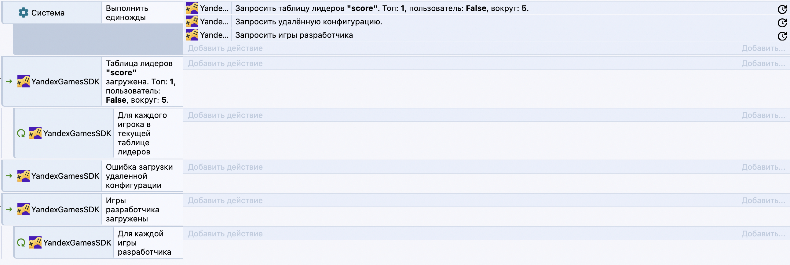
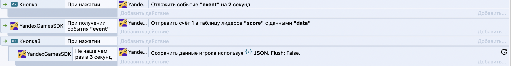
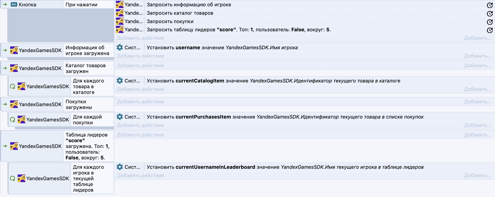

# Документация
В ближайшее время команда Construct прекращает поддержку плагинов на Addon SDK V1. В данный момент осуществляем переход на Addon SDK V2. Плагин находится на этапе бета-тестирования.

## Переход на SDK V2

1. ### Циклические условия

    Новая версия SDK не позволяет использовать циклические условия с асинхронными операциями, как это было в предыдущей версии (циклы "Для каждого игрока в таблице лидеров", "Используя информацию об игроке", "Для каждой игры" и тд.). Теперь они имеют метку **[УСТАРЕЛ]** и не работают корректно, в дальнейшем будут удалены.

    Вместо них используется более стандартизированный подход "действие-событие". Каждому асинхронному событию (запрос таблицы лидеров, информации об игроке и тд.) теперь соответствует событие с такой же сигнатурой, как и действие и префиксами "При успешной загрузке..." и "При ошибке загрузки...". Далее в качестве подсобытия успешной загрузке можно использовать циклические условия.
    
    Пример с запросом таблицы лидеров, удаленной конфигурации и игр разработчика.

    

2. ### Debouce и Throttle

    Debounce и trottle больше не используют ложные циклы.

    Debounce теперь построен по аналогичной концепции с циклическими условиями и похож на связку "Сигнал"-"При получении сигнала" в Construct.
    
    Обязательным параметром Throttle теперь является уникальный идентификатор, он необходим для корректной работы.

    Для обратной совместимости старые Debounce и Throttle имеют метку **[УСТАРЕЛ]**.

    Пример использования Debounce и Throttle:

    

3. ### Expressions

    Часть выражений (информация об игроке, товары) были общими для данных об игроке, таблицы лидеров, каталога, списка покупок и конкретной покупки.

    Для предотвращения потенциальной гонки состояний для каждых отдельных данных теперь существует собственные набор выражений. Так, для таблиц лидеров выражения имеют постфикс "... в таблице лидеров", для выражений с информацией о пользователе такого постфикста нет. Для товаров в каталоге и списке покупок постфиксы соответственно "... в каталоге" и "... в списке покупок". Для отдельной покупки постфикс отсутствует. Для списка игр разработчика постфикс ...в списке игр разработчика". Пример для нескольки запросов, обратите внимание, какие выражения в каких циклах используются:

    

