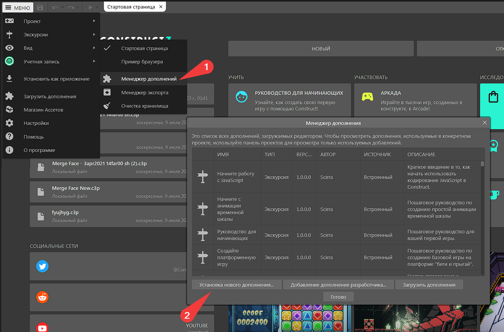

# Установка плагина

## Добавление аддона

Для начала скачайте последнюю версию плагина.

[YandexGamesSDK-1.0.0.0.c3addon](../bin/YandexGamesSDK-1.0.0.0.c3addon)

В главном меню Construct 3 перейдите в "_Меню -> Вид -> Менеджер Дополнений"_. Далее, в появившемся окне нажмите "_Установка нового дополнения..._" и выберите скачанный .c3addon файл.

<figure><figcaption></figcaption></figure>

## Использование в проекте

Чтобы начать пользоваться плагином Яндекс.Игр в вашем проекте, нажмите правой кнопкой по макету и нажмите "_Вставить новый объект_".

<figure><figcaption></figcaption></figure>

В появившемся меню пролистайте до "_YandexGamesSDK_" и нажмите вставить.

<figure><figcaption></figcaption></figure>

Теперь мы можете спокойно пользоваться всеми возможностями плагина Яндекс.Игры SDK.
