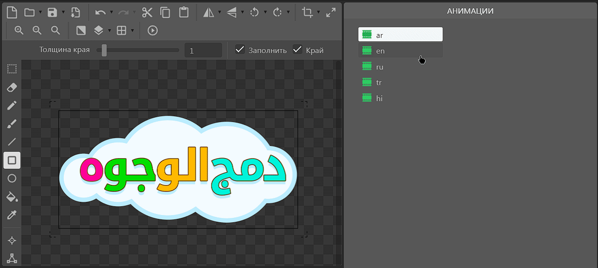

# Локализация спрайтов

## Добавление анимации

Для того, чтобы локализировать спрайт, достаточно добавить в список анимации спрайта новые анимации с нужными вам [кодами языков](https://yandex.ru/dev/games/doc/ru/concepts/languages-and-domains).

Создаём спрайт, добавляем новую анимацию с нужным кодом языка, добавляем графику. По итогу у вас должен получиться подобный результат.

Убедитесь, что в спрайте нет лишних анимации, которые будут иметь имя, которые не соответствуют ни одному [допустимому коду языка](https://yandex.ru/dev/games/doc/ru/concepts/languages-and-domains). В противном случае плагин пропустит ваш спрайт во время локализации.

<figure><figcaption></figcaption></figure>

Теперь, когда мы нажмём кнопку играть (превью), то мы увидим, что наш спрайт автоматически поменял анимацию на соответствующую текущему языку игрока.

<figure><figcaption></figcaption></figure>

## Пример

Ознакомиться с примером использования локализации текста можно ниже.
- [Sprite Localization Example.c3p](../assets/Sprite_Localization_Example.c3p)

